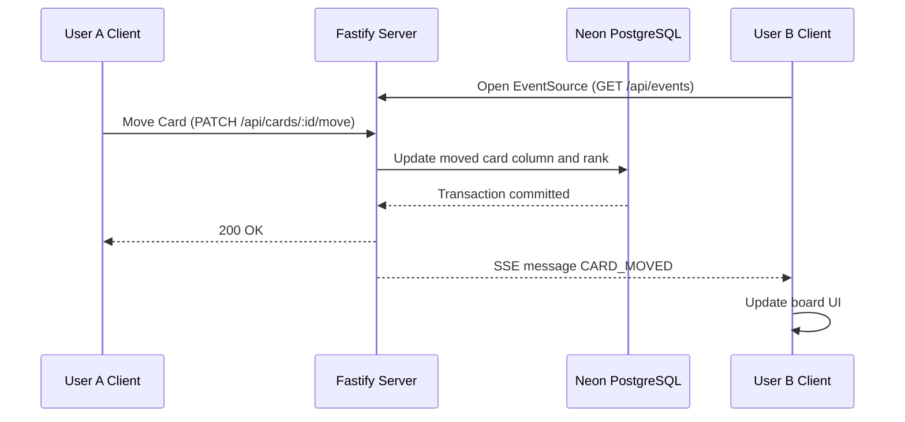

# Coboard

> Real-time collaborative Kanban board with lexicographical fractional indexing.

Coboard is a real-time project board built with a Next.js frontend, a Fastify backend, Server-Sent Events, Prisma, and PostgreSQL. It supports multi-user board updates, drag-and-drop card movement, optimistic UI updates, and scoped board collaboration through short board IDs.

The project is split into two apps:

- `client`: Next.js frontend, deployed on Vercel
- `server`: Fastify API backend, designed to run on Railway
- Database: Neon PostgreSQL, managed through Prisma

---

## Architecture

### Fractional Indexing

Coboard avoids expensive reorder operations by assigning each card a lexicographical rank string through fractional indexing.

With traditional integer ordering, moving one card to the top of a large column may require updating every other card position. Coboard instead updates only the moved card:

- `columnId`: the destination column
- `positionRank`: the new lexicographical rank between neighboring cards

This keeps card movement close to an `O(1)` database write.

Example:

```text
Initial state:
[ Card 1 (Rank: "a0") ] -> [ Card 2 (Rank: "a1") ]

After inserting Card 3 between them:
[ Card 1 (Rank: "a0") ] -> [ Card 3 (Rank: "a0V") ] -> [ Card 2 (Rank: "a1") ]
```

---

## Tech Stack

- Frontend: Next.js, React, Tailwind CSS, Lucide React, `@hello-pangea/dnd`
- Backend: Node.js, Fastify, native Server-Sent Events
- Database: Neon PostgreSQL
- ORM: Prisma
- Frontend hosting: Vercel
- Backend hosting: Railway

---

## Real-Time Event Flow



---

## Local Setup

### 1. Backend

Navigate to the backend:

```bash
cd server
```

Install dependencies:

```bash
npm install
```

Create or update `server/.env`:

```env
DATABASE_URL="your-neon-postgres-connection-string"
PORT=5000
```

Sync the Prisma schema:

```bash
npx prisma db push
```

Start the backend:

```bash
npm run dev
```

The backend runs at:

```text
http://localhost:5000
```

### 2. Frontend

Open another terminal:

```bash
cd client
```

Install dependencies:

```bash
npm install
```

Create or update `client/.env.local`:

```env
NEXT_PUBLIC_API_URL=http://localhost:5000
```

Start the frontend:

```bash
npm run dev
```

The frontend runs at:

```text
http://localhost:3000
```

---

## Production Deployment

### Neon

Create a Neon PostgreSQL project and database for Coboard. Use the Neon connection string as the backend `DATABASE_URL`.

The Prisma schema uses PostgreSQL:

```prisma
datasource db {
  provider = "postgresql"
  url      = env("DATABASE_URL")
}
```

### Railway Backend

Deploy the backend service from this repository. The included `railway.json` tells Railway to build and start the backend from the `server` folder.

Set this Railway environment variable:

```env
DATABASE_URL=your-neon-postgres-connection-string
```

Railway start command:

```bash
cd server && npm start
```

The server start script runs:

```bash
prisma db push && node dist/index.js
```

This keeps the Neon database schema synced before the backend starts.

### Vercel Frontend

Deploy the frontend to Vercel from this repository. The included `vercel.json` builds the app from the `client` folder.

Set this Vercel environment variable:

```env
NEXT_PUBLIC_API_URL=https://your-railway-backend-url
```

Do not put the Neon database URL in Vercel. The frontend should only know the public backend URL.

---

## Environment Variables

Backend, `server/.env`:

```env
DATABASE_URL="your-neon-postgres-connection-string"
PORT=5000
```

Frontend, `client/.env.local`:

```env
NEXT_PUBLIC_API_URL=http://localhost:5000
```

Vercel production:

```env
NEXT_PUBLIC_API_URL=https://your-railway-backend-url
```

Railway production:

```env
DATABASE_URL=your-neon-postgres-connection-string
```

---

## Main API Routes

- `GET /api/events`: Server-Sent Events stream for real-time board updates
- `POST /api/boards`: Create a new board
- `GET /api/boards/:id`: Check and load board metadata
- `GET /api/columns?boardId=...`: Load board columns and cards
- `POST /api/columns`: Create a column
- `POST /api/cards`: Create a card
- `PATCH /api/cards/:id`: Update card details
- `PATCH /api/cards/:id/move`: Move or reorder a card
- `DELETE /api/cards/:id`: Delete a card

---

## Notes

- Local frontend should use `http://localhost:5000`.
- Production frontend should use the Railway backend URL.
- Backend stores all board data in Neon PostgreSQL.
- SSE presence and board events are scoped by board ID.
- The repository includes separate deployment config for Vercel and Railway.
