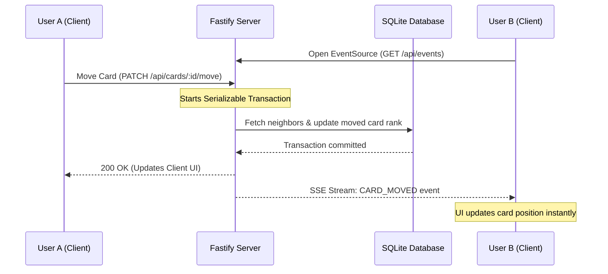

# SyncBoard 📋✨
> **Real-Time Collaborative Kanban Engine with Lexicographical Fractional Indexing**

SyncBoard is a production-grade, highly performant real-time project management board (similar to Jira or Trello) built from scratch. It features real-time multi-user synchronization, responsive drag-and-drop mechanics, and a sleek modern dark-themed dashboard.

Most importantly, SyncBoard elegantly solves the **Order Indexing Concurrency** problem using a **Lexicographical Sorting Algorithm with Fractional Indexing**, reducing database update complexity from $O(N)$ write overhead to a single $O(1)$ write operation.

---

## 🎥 1-Minute Video Demonstration
*(Placeholder for a 1-minute video demonstration showcasing simultaneous multi-user drag-and-drop operations, real-time board updates, and optimistic UI transitions)*

[SyncBoard Demo Video Placeholder]

---

## 🧠 The Architecture: Why Fractional Indexing?

### The Problem: Order Indexing Concurrency
In traditional Kanban engines, tasks in a column are positioned using sequential integers (`0, 1, 2, 3...`). 
* If a column has 1,000 cards and a user moves a card to the **top** (index `0`), the database must shift every other card's index:
  $$\text{Card}_2 \to \text{index } 1, \quad \text{Card}_3 \to \text{index } 2, \quad \dots \quad \text{Card}_{1000} \to \text{index } 999$$
* This creates **massive database write overhead ($O(N)$)**.
* In collaborative environments, if User A and User B move cards simultaneously in the same column, it leads to severe **data races, transaction deadlocks, and corrupted order states**.

### The Solution: Lexicographical Fractional Indexing
SyncBoard assigns each card a **variable-length base-62 rank string** (e.g. `'a0'`, `'a1'`). Cards are ordered in SQL using a simple string comparison (`ORDER BY position_rank ASC`).
* **Inserting or Moving**: When a card is placed between Card A (rank `'a0'`) and Card B (rank `'a1'`), the backend calculates the midpoint rank, resulting in `'a0V'`.
* **Zero Cascading Writes**: To move a card, the database updates **ONLY** that single card's `positionRank` and `columnId` ($O(1)$ write operation). No other records are modified.
* **Lexicographical Space**: The base-62 alphabet (`0-9`, `A-Z`, `a-z`) provides an infinite division space, preventing indexing exhaustion.

```
Initial State:
[ Card 1 (Rank: 'a0') ]  <---  [ Card 2 (Rank: 'a1') ]

After Moving Card 3 between Card 1 and Card 2:
[ Card 1 (Rank: 'a0') ]  <---  [ Card 3 (Rank: 'a0V') ]  <---  [ Card 2 (Rank: 'a1') ]
```

---

## ⚡ Tech Stack Selection

* **Frontend**: Next.js (App Router), React, Tailwind CSS (v4), Lucide React (Icons), and `@hello-pangea/dnd` (React 18-compatible drag-and-drop).
* **Backend**: Node.js with Fastify (ultra-low overhead HTTP framework) and native Server-Sent Events (SSE).
* **Database & ORM**: SQLite (default for zero-config local runs) with Prisma ORM.

---

## 🔄 Real-Time Event Lifecycle (SSE)

Unidirectional **Server-Sent Events (SSE)** are used to broadcast board updates. SSE is native to web browsers, lightweight, and extremely performant over HTTP/2.



---

## 🚀 Getting Started (Windows Quick Start)

If you are on Windows, you can start the entire stack instantly.

1. **Double-click** the `start.bat` file in the project root directory.
2. This script launches two command prompts running:
   * **Backend server** at `http://localhost:5000`
   * **Frontend Next.js client** at `http://localhost:3000`
3. Open two browser windows side-by-side to test real-time collaboration!

---

## 🛠️ Manual Installation & Run

If you wish to run the client and server manually:

### 1. Backend Server Setup
Navigate to the server directory:
```bash
cd server
```
Install dependencies and sync database:
```bash
npm install
npx prisma db push
```
*(Optional) Seed the database with sample columns and tickets:*
```bash
npx prisma db seed
```
Start development server:
```bash
npm run dev
```

### 2. Frontend Next.js Setup
Navigate to the client directory:
```bash
cd ../client
```
Install dependencies:
```bash
npm install
```
Start development server:
```bash
npm run dev
```

---

## 🛡️ Edge Cases Handled
1. **Precision Boundary Adjustments**: If two cards are moved into the same gap repeatedly, the algorithm extends rank string lengths (e.g. `'a0'` -> `'a0V'` -> `'a0VV'`) rather than failing.
2. **Transaction Conflict Control**: The server executes moves inside serializable transactions to prevent race conditions from concurrent updates.
3. **Optimistic UI Graceful Rollback**: If a network interruption occurs during a drag-and-drop, the frontend rolls back the card to its original position instantly and displays a warning toast.
4. **Sender Exclusion**: The broadcasting engine skips sending messages back to the initiating client to avoid redundant UI renders.
